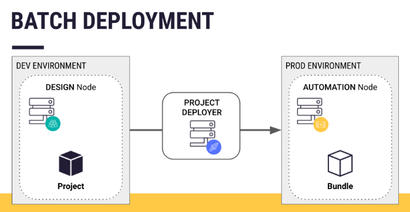
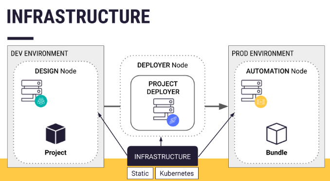

# Dataiku Project Deployment

- 참고 :https://academy.dataiku.com/path/mlops/projects-in-production/1069661

### 1. Dataiku Project 배포 

- Project Deployer가 Design node의 project를 Automation node에 있는 bundle로 전환하여 project를 변환함.
  - Project에는 metrics, checks, reporter, optimized pipeline, well-documented workflow 등을 포함한 secenario가 있음.

#### 1-1. 배포 주의사항

- Design Node에서 plugin이나 개발 환경이 있으면 Automation Node에도 같이 배포 해야 함.

#### 1-2. Project Deployer Architecture

- Local or Standalone Deployer 설치 및 설정 :https://doc.dataiku.com/dss/latest/deployment/setup.html#using-a-standalone-deployer 

- Local Deployer : 사용자의 Infratructure에서 하나의 Design or Automation node가 있는 경우, Project Deployer는 Dataiku Node 자체의 일부로 될 수 있음. 따로 추가 설정이 불필요함.
- Standalone Deployer : 사용자의 Infrastructure에서 여러 Design and/or Automation node가 있는 경우, 모든 Design and/or Automation node에 대해 중앙 집중식 배포자 역할을 하는 별도의 DSS노드를 설치할 수 있음.

