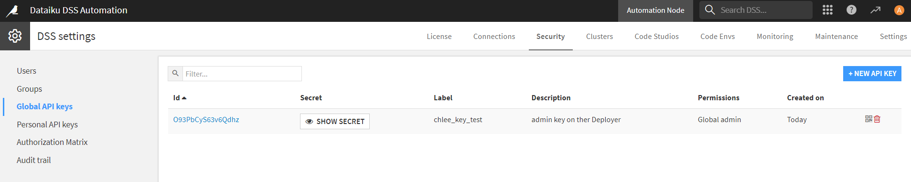

# Dataiku Infrastructure

- 참고 :https://doc.dataiku.com/dss/12/deployment/project-deployment-infrastructures.html
- Project Deployer와 API Deployer가 담당하는 각각의 Infrastructure 이 있음.

### 1. Dataiku Deployment Infrastructure 생성

- 사전에 Automation Node가 구축되어야 Deployment Infrastructure 생성 가능.
- API Infrastructure 구축 방법은 따로 있음.

#### 1-1. Automation Node Install(Custom Dataiku)

참고 : https://doc.dataiku.com/dss/12/installation/custom/automation-node.html

- Project Deployer가 관리하는 Infrastructure 위주 설명임. Automation node구축을 위한 것.

##### 1-1-1. 설치 순서

- 압축된 Dataiku DSS 설치 파일 압축을 푼다.
- 다음 Automation Node 설치 명령어를 입력한다.

```shell
# DATA_DIR : 사용할 디렉터리 위치
# PORT : Automation Node 접속할 PORT 번호
# LICESS_FILE : DSS 라이센스 파일
# 라이센스 관련 에러 발생 시 "-l LICENSE_FILE" 지우고 설치. 다음 라이센스 정보는 따로 입력.
dataiku-dss-VERSION/installer.sh -t automation -d DATA_DIR -p PORT -l LICENSE_FILE
```



- 설치 완료 시 AutomationNode에 Administration -> Security -> Global API keys (발급 받아야함) => Personal API keys 도 가능.
- Design Node가 설치된 DSS에서 Infrastructure 생성을 진행
- 밑의 그림의 Admin API key에 Global API key를 입력
- Automation node URL : Automation Node가 설치된 DSS URL
- 
- 입력 완료 후 Infrastructure의 setting 탭에서 사용자 그룹에 대해 이 Infrastructure의 프로젝트를 배포할 수 있는 권한을 부여함.
- 모든 Automation Node에 대해 반복.

#### 1-2. Deployer Node Install

- 참고 : https://doc.dataiku.com/dss/12/installation/custom/deployer-node.html
