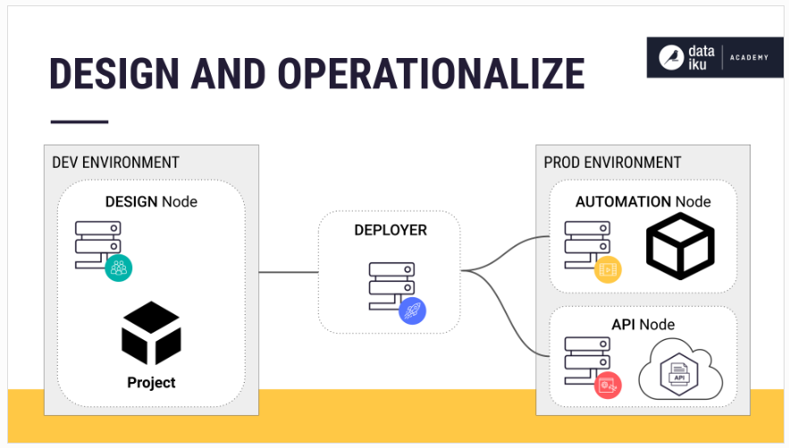
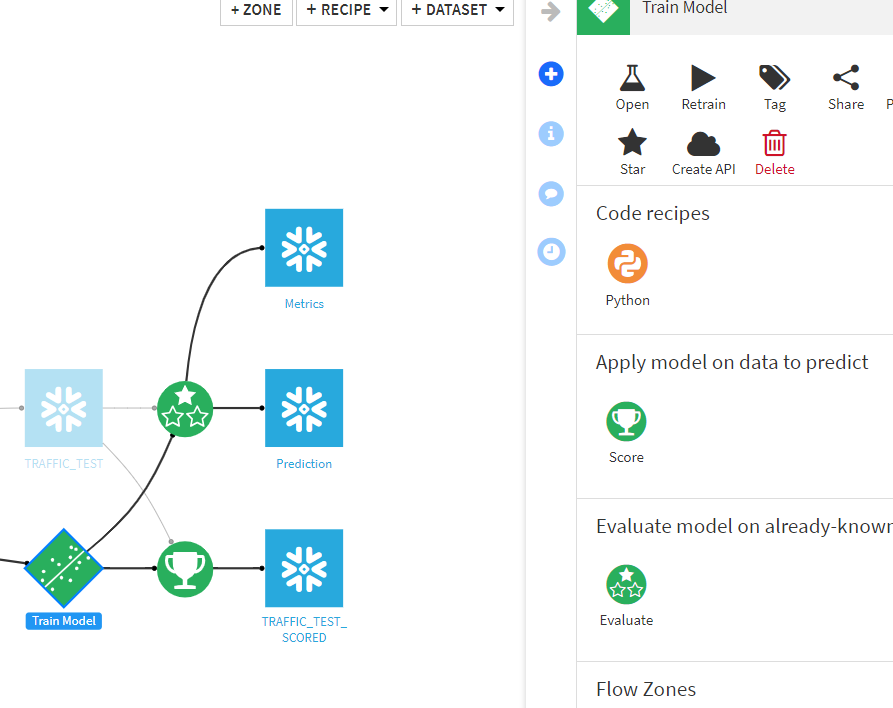
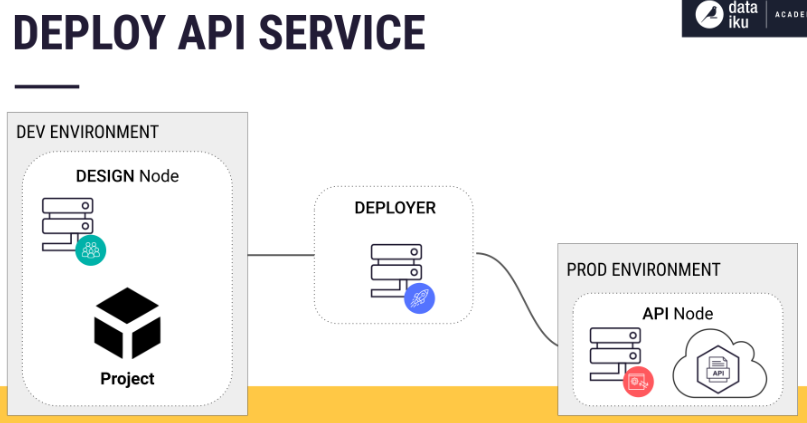

# Dataiku MLOps Architecture 

- 참고 :https://academy.dataiku.com/path/mlops/production-concepts/1140019

### 1. Dataiku architecture tools and nodes

- Dataiku 아키텍처는 모델을 설계한 다음 운영하기 위해 다양한 노드로 구성됨. 이러한 노드는 각각 고유한 목적을 가진 고유한 환경으로 간주할 수 있지만 같은 플랫폼의 일부임.
- DEV ENVIRONMENT : 개발환경                     PROD ENVIRONMENT : 배포된 환경
- 

#### 1-2. Scenario Types

##### 1-2-1. step-based 

-  시나리오를 Dataiku의 visual Interface로 구성할 수 있음.

### 2. Dataiku 배포 관련 용어 및 참고 사항

참고 : https://academy.dataiku.com/path/mlops/production-concepts/1140019

- Flow를 설계한 후 모든 작업을 bundle로 패키지화 하여 배포함. recipes, transformation, automation scenarios 등 포함.
- **bundle** 생성 후 Deployer를 사용하여 프로젝트를 배포.
- **Deployer** : 프로젝트 및 API 서비스를 배포하기 위한 도구.
  - Project Deployer가 bundle을 Automation node 에 배포함.
- **Automation node** : 배치 처리된 데이터 또는 기계학습 채점 및 재교육을 운영하기 위한 격리된 환경.
- **Design node** : ex) 사용자가 Flow에서 레시피 생성하고 모델 학습,시나리오 생성 등 설계하는 환경.
- **Real-Time Scoring** : 훈련된 모델을 가지고 예측을 실시간으로 처리함. 먼저 설계 노드를 사용하여 모델을 교육 후, 배포할 모델에서 API endpoint를 생성. 이 API endpoint는 API Designer를 사용하여 API 서비스로 패키지화함. API endpoint == prediction model.  "Train Model" 클릭 후 오른쪽 상단 "Create API" 클릭.

- API Service 버전을 Deployer에게 push하고 API Deployer는 프로젝트와 API 서비스를 모두 배포할 수 있음.

  - API Deployer : Deployer의 다른 구성 요소. API Deployer는 API 서비스를 API Node로 push함.
  - API Node : 수평적으로 확장 가능하고 가용성이 높은 **웹 서버**. ML 모델을 운영하고 예측 요청에 응답함.

  

